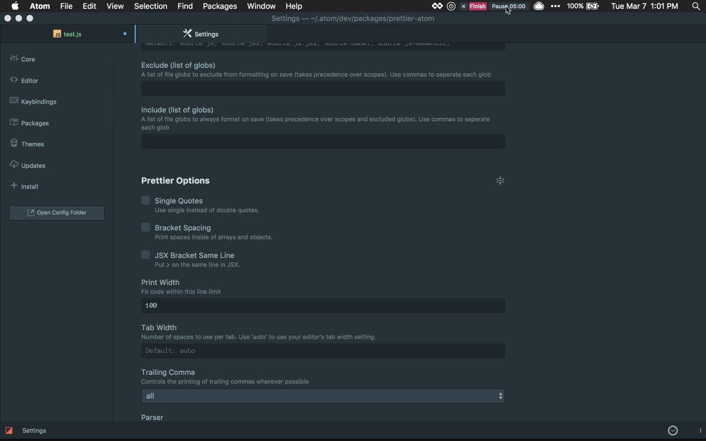

# Prettier for Atom [![Watch on GitHub][github-watch-badge]][github-watch][![Star on GitHub][github-star-badge]][github-star][![Tweet][twitter-badge]][twitter]

<!-- [![Dependencies][dependencyci-badge]][dependencyci] TODO: Add dependency CI! -->

<!-- [![Code of Conduct][coc-badge]][coc] -->

[![Version][version-badge]][package]
[![Downloads][downloads-badge]][package]
[![Build Status][build-badge]][build]
[![Code Coverage][coverage-badge]][coverage]
[![MIT License][license-badge]][license]
[![All Contributors][all-contributors-badge]](#contributors)
[![PRs Welcome][prs-badge]][prs]

Atom package to format your code using [Prettier](https://github.com/prettier/prettier).



## Installation

```
apm install prettier-atom
```

Or go to _Settings → Install_ and search for `prettier-atom`.

Make sure to restart Atom after the package is installed.

## How to use

There are two ways to format your code:

- Automatically **format on save** (requires enabling in _Packages → Prettier → Toggle Format on Save_)
- Run the command `Prettier: Format` to invoke Prettier manually
  - Windows/Linux: <kbd>ctrl</kbd> + <kbd>alt</kbd> + <kbd>f</kbd>
  - Mac: <kbd>control</kbd> + <kbd>option</kbd> + <kbd>f</kbd>

Prettier will search up the file tree looking for a [prettier config](https://prettier.io/docs/en/configuration.html) to use. If none is found, Prettier will use its default settings.

Prettier will also respect your `.prettierignore` file.

## What version of Prettier gets used?

By default, we use the prettier instance in your project's `node_modules` directory. We highly recommend adding Prettier to your dependencies so that your team, CI tooling, and any scripts using Prettier all format code exactly the same way.

If Prettier can't be found in your project's node modules, then
we fall back to using the version that comes bundled with the prettier-atom package (version changes are documented in the [CHANGELOG](./CHANGELOG.md)).

## Configuring default rules

Some users may not wish to create a new [Prettier config](https://prettier.io/docs/en/configuration.html) for every project. Because Prettier searches recursively up the filepath, you can place a global prettier config at `~/.prettierrc` to be used as a fallback.

## Using ESLint

![prettier-eslint demo][prettier-eslint-demo]

There are three ways to use ESLint with Prettier and prettier-atom:

### 1. Use ESLint to run Prettier

You can opt not to use prettier-atom and instead configure ESLint to run prettier. ([see details](https://prettier.io/docs/en/eslint.html#use-eslint-to-run-prettier))

### 2. Turn off ESLint's Formatting Rules

You can disable ESLint rules for things that Prettier itself fixes. This allows both tools to run alongside each other without conflicting with one another. ([see details](https://prettier.io/docs/en/eslint.html#turn-off-eslint-s-formatting-rules))

### 3. Use prettier-eslint

The [prettier-eslint][prettier-eslint] package (shipped with prettier-atom) will recursively search up the file tree for your ESLint settings and infer the corresponding Prettier settings to use when formatting. After formatting, prettier-eslint will invoke ESLint to fix remaining issues. Check the "ESLint Integration" checkbox to enable.

> Note: If you are using the [linter-eslint](https://github.com/AtomLinter/linter-eslint) package alongside prettier-atom, please **ensure you have unchecked its "Fix on save" checkbox**. Leaving it enabled will cause a race condition between prettier-atom and linter-eslint. After it has finished formatting your code, **prettier-atom will automatically invoke the linter package's `lint` command for you**.

## Using Stylelint

The [prettier-stylelint](https://github.com/hugomrdias/prettier-stylelint) package (shipped with prettier-atom) derives prettier settings from your [stylelint configuration](https://stylelint.io/user-guide/configuration/) to use when formatting. After formatting, prettier-stylelint will invoke Stylelint to fix remaining issues. Check the "Stylelint Integration" checkbox to enable.

> Note: prettier-atom automatically detects when you are in an Atom scope that stylelint supports and switches to using it instead of normal Prettier when formatting that file.

## Troubleshooting formatting problems

If Prettier is not formatting something properly, please open an issue on the [Prettier repository](https://github.com/prettier/prettier), not this repository.

## Inspiration

This repository was created by [James Long][james-long] to go along with his Prettier project. [Kent C. Dodds][kentcdodds] extended Prettier to add `eslint --fix` integration as [prettier-eslint][prettier-eslint] and forked the original `prettier-atom` plugin to create the `prettier-eslint-atom` plugin. Because it became clear that the plugins were very similar and thus maintenance made easier by combining the two, [Rob Wise][robwise] merged `prettier-eslint-atom` back into `prettier-atom`.

## Maintainers

[Rob Wise][robwise]

## Contributors

Thanks goes to these people ([emoji key][emojis]):

<!-- ALL-CONTRIBUTORS-LIST:START - Do not remove or modify this section -->
<!-- prettier-ignore -->
| [<br /><sub><b>James Long</b></sub>](http://jlongster.com)<br />[💬](#question-jlongster "Answering Questions") [💻](https://github.com/prettier/prettier-atom/commits?author=jlongster "Code") [📖](https://github.com/prettier/prettier-atom/commits?author=jlongster "Documentation") [🔌](#plugin-jlongster "Plugin/utility libraries") [👀](#review-jlongster "Reviewed Pull Requests") | [<br /><sub><b>Rob Wise</b></sub>](https://robwise.github.io)<br />[💻](https://github.com/prettier/prettier-atom/commits?author=robwise "Code") [📖](https://github.com/prettier/prettier-atom/commits?author=robwise "Documentation") [💬](#question-robwise "Answering Questions") [💡](#example-robwise "Examples") [👀](#review-robwise "Reviewed Pull Requests") [⚠️](https://github.com/prettier/prettier-atom/commits?author=robwise "Tests") | [<br /><sub><b>Kent C. Dodds</b></sub>](https://kentcdodds.com)<br />[💻](https://github.com/prettier/prettier-atom/commits?author=kentcdodds "Code") [📖](https://github.com/prettier/prettier-atom/commits?author=kentcdodds "Documentation") [🚇](#infra-kentcdodds "Infrastructure (Hosting, Build-Tools, etc)") | [<br /><sub><b>Luca Barone</b></sub>](https://github.com/cloud-walker)<br /> | [<br /><sub><b>Arnar Þór Sveinsson</b></sub>](https://github.com/arnarthor)<br />[💻](https://github.com/prettier/prettier-atom/commits?author=arnarthor "Code") | [<br /><sub><b>Adam Miskiewicz</b></sub>](http://www.adammiskiewicz.com/)<br />[💻](https://github.com/prettier/prettier-atom/commits?author=skevy "Code") | [<br /><sub><b>Ori Livni</b></sub>](http://www.orilivni.com)<br />[💻](https://github.com/prettier/prettier-atom/commits?author=oriSomething "Code") |
| :---: | :---: | :---: | :---: | :---: | :---: | :---: |
| [<br /><sub><b>Leon Chen</b></sub>](https://transcranial.github.io)<br />[💻](https://github.com/prettier/prettier-atom/commits?author=transcranial "Code") | [<br /><sub><b>Christopher Chedeau</b></sub>](http://blog.vjeux.com/)<br />[💬](#question-vjeux "Answering Questions") [💻](https://github.com/prettier/prettier-atom/commits?author=vjeux "Code") [🔌](#plugin-vjeux "Plugin/utility libraries") | [<br /><sub><b>Christoph Geschwind</b></sub>](http://christoph-geschwind.de)<br />[💻](https://github.com/prettier/prettier-atom/commits?author=1st8 "Code") | [<br /><sub><b>Andrew Hutchings</b></sub>](https://andrewhutchings.com)<br />[💻](https://github.com/prettier/prettier-atom/commits?author=ahutchings "Code") | [<br /><sub><b>David Schnurr</b></sub>](http://davidschnurr.com)<br />[💻](https://github.com/prettier/prettier-atom/commits?author=schnerd "Code") | [<br /><sub><b>Ryan Cole</b></sub>](http://rycole.com/)<br />[💻](https://github.com/prettier/prettier-atom/commits?author=ryancole "Code") | [<br /><sub><b>Dara Hak</b></sub>](https://github.com/darahak)<br />[💻](https://github.com/prettier/prettier-atom/commits?author=darahak "Code") [📖](https://github.com/prettier/prettier-atom/commits?author=darahak "Documentation") |
| [<br /><sub><b>Stephen John Sorensen</b></sub>](http://www.stephenjohnsorensen.com/)<br />[💻](https://github.com/prettier/prettier-atom/commits?author=spudly "Code") | [<br /><sub><b>Lukas Geiger</b></sub>](https://github.com/lgeiger)<br />[💻](https://github.com/prettier/prettier-atom/commits?author=lgeiger "Code") [⚠️](https://github.com/prettier/prettier-atom/commits?author=lgeiger "Tests") | [<br /><sub><b>Viktor Charypar</b></sub>](https://github.com/charypar)<br />[💻](https://github.com/prettier/prettier-atom/commits?author=charypar "Code") [⚠️](https://github.com/prettier/prettier-atom/commits?author=charypar "Tests") | [<br /><sub><b>Mats Högberg</b></sub>](http://mats.hgbrg.se)<br />[💻](https://github.com/prettier/prettier-atom/commits?author=mhgbrg "Code") | [<br /><sub><b>Roman</b></sub>](https://github.com/RoM4iK)<br />[💻](https://github.com/prettier/prettier-atom/commits?author=RoM4iK "Code") | [<br /><sub><b>vaibhav</b></sub>](https://vaibhavchatarkar.com)<br />[💻](https://github.com/prettier/prettier-atom/commits?author=da-vaibhav "Code") | [<br /><sub><b>Karl Horky</b></sub>](https://work.karlhorky.com)<br />[💻](https://github.com/prettier/prettier-atom/commits?author=karlhorky "Code") |
| [<br /><sub><b>Dan Abramov</b></sub>](http://twitter.com/dan_abramov)<br />[💻](https://github.com/prettier/prettier-atom/commits?author=gaearon "Code") | [<br /><sub><b>Murphy Randle</b></sub>](https://sploding.rocks)<br />[💻](https://github.com/prettier/prettier-atom/commits?author=splodingsocks "Code") [🐛](https://github.com/prettier/prettier-atom/issues?q=author%3Asplodingsocks "Bug reports") | [<br /><sub><b>Matthieu Lemoine</b></sub>](https://matthieulemoine.com)<br />[💻](https://github.com/prettier/prettier-atom/commits?author=MatthieuLemoine "Code") | [<br /><sub><b>Ron Green</b></sub>](https://github.com/rgreenjr)<br />[💻](https://github.com/prettier/prettier-atom/commits?author=rgreenjr "Code") | [<br /><sub><b>Harold Treen</b></sub>](https://haroldtreen.com)<br />[🐛](https://github.com/prettier/prettier-atom/issues?q=author%3Aharoldtreen "Bug reports") [💻](https://github.com/prettier/prettier-atom/commits?author=haroldtreen "Code") | [<br /><sub><b>Nikita Mashukov</b></sub>](https://github.com/ferdibiflator)<br />[💻](https://github.com/prettier/prettier-atom/commits?author=ferdibiflator "Code") | [<br /><sub><b>Sam Horton</b></sub>](https://github.com/SavePointSam)<br />[💻](https://github.com/prettier/prettier-atom/commits?author=SavePointSam "Code") [⚠️](https://github.com/prettier/prettier-atom/commits?author=SavePointSam "Tests") |
| [<br /><sub><b>olsonpm</b></sub>](https://github.com/olsonpm)<br />[💻](https://github.com/prettier/prettier-atom/commits?author=olsonpm "Code") | [<br /><sub><b>David Singleton</b></sub>](http://dsingleton.co.uk)<br />[📖](https://github.com/prettier/prettier-atom/commits?author=dsingleton "Documentation") | [<br /><sub><b>Chris Drackett</b></sub>](https://github.com/chrisdrackett)<br />[💻](https://github.com/prettier/prettier-atom/commits?author=chrisdrackett "Code") [🎨](#design-chrisdrackett "Design") |
<!-- ALL-CONTRIBUTORS-LIST:END -->

This project follows the [all-contributors][all-contributors] specification. Contributions of any kind are welcome!

## LICENSE

[MIT](./LICENSE.md)

[npm]: https://www.npmjs.com/
[node]: https://nodejs.org
[build-badge]: https://img.shields.io/travis/prettier/prettier-atom.svg?style=flat-square
[build]: https://travis-ci.org/prettier/prettier-atom
[coverage-badge]: https://img.shields.io/codecov/c/github/prettier/prettier-atom.svg?style=flat-square
[coverage]: https://codecov.io/github/prettier/prettier-atom
[dependencyci-badge]: https://dependencyci.com/github/prettier/prettier-atom/badge?style=flat-square
[dependencyci]: https://dependencyci.com/github/prettier/prettier-atom
[version-badge]: https://img.shields.io/apm/v/prettier-atom.svg?style=flat-square
[package]: https://atom.io/packages/prettier-atom
[downloads-badge]: https://img.shields.io/apm/dm/prettier-atom.svg?style=flat-square
[license-badge]: https://img.shields.io/apm/l/prettier-atom.svg?style=flat-square
[license]: https://github.com/prettier/prettier-atom/blob/master/LICENSE
[prs-badge]: https://img.shields.io/badge/PRs-welcome-brightgreen.svg?style=flat-square
[prs]: http://makeapullrequest.com
[coc-badge]: https://img.shields.io/badge/code%20of-conduct-ff69b4.svg?style=flat-square
[coc]: https://github.com/prettier/prettier-atom/blob/master/other/CODE_OF_CONDUCT.md
[roadmap-badge]: https://img.shields.io/badge/%F0%9F%93%94-roadmap-CD9523.svg?style=flat-square
[roadmap]: https://github.com/prettier/prettier-atom/blob/master/other/ROADMAP.md
[github-watch-badge]: https://img.shields.io/github/watchers/prettier/prettier-atom.svg?style=social
[github-watch]: https://github.com/prettier/prettier-atom/watchers
[github-star-badge]: https://img.shields.io/github/stars/prettier/prettier-atom.svg?style=social
[github-star]: https://github.com/prettier/prettier-atom/stargazers
[twitter]: https://twitter.com/intent/tweet?text=Check%20out%20prettier-atom!%20https://github.com/prettier/prettier-atom%20%F0%9F%91%8D
[twitter-badge]: https://img.shields.io/twitter/url/https/github.com/prettier/prettier-atom.svg?style=social
[emojis]: https://github.com/kentcdodds/all-contributors#emoji-key
[all-contributors]: https://github.com/kentcdodds/all-contributors
[all-contributors-badge]: https://img.shields.io/badge/all_contributors-13-orange.svg?style=flat-square
[prettier]: https://github.com/prettier/prettier
[prettier-eslint]: https://github.com/prettier/prettier-eslint
[kentcdodds]: https://github.com/kentcdodds
[james-long]: https://github.com/jlongster
[robwise]: https://github.com/robwise
[prettier-demo]: https://github.com/prettier/prettier-atom/raw/master/prettier-demo.gif
[prettier-eslint-demo]: https://github.com/prettier/prettier-atom/raw/master/prettier-eslint-demo.gif
